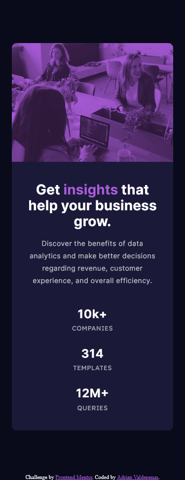

# Frontend Mentor - Stats preview card component solution

This is a solution to the [Stats preview card component challenge on Frontend Mentor](https://www.frontendmentor.io/challenges/stats-preview-card-component-8JqbgoU62). Frontend Mentor challenges help you improve your coding skills by building realistic projects.

## Table of contents

- [Overview](#overview)
  - [The challenge](#the-challenge)
  - [Screenshot](#screenshot)
  - [Links](#links)
- [My process](#my-process)
  - [Built with](#built-with)
  - [What I learned](#what-i-learned)
  - [Continued development](#continued-development)
- [Author](#author)

## Overview

### The challenge

Users should be able to:

- View the optimal layout depending on their device's screen size

### Screenshot

### Links

- Solution URL: [Add solution URL here](https://irnano.github.io/stats-preview-card-component-main/)

## My process

### Built with

- Semantic HTML5 markup
- CSS Grid
- Mobile-first workflow
- [SASS](https://sass-lang.com/) - For styles

### What I learned

I learned about basic Grid css, overlay color on image and enhancement of overlay color with multi-blend property

### Continued development

Learn more about CSS Grid, SASS, and HTML

## Author

- Website - [Adrian Valdepenas](https://avaldepenas.vercel.app)
- Frontend Mentor - [@iRNano](https://www.frontendmentor.io/profile/iRNano)
